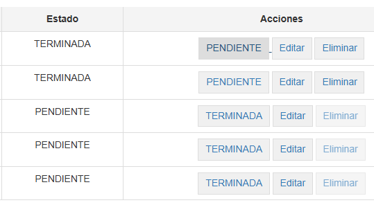

# API REST: Task Manager

Bienvenido a **Task Manager**, una API REST diseñada para gestionar tareas diarias de manera eficiente. 
Con esta herramienta, puedes crear, actualizar, marcar el estado de las tareas como 'PENDIENTE' o 'TERMINADA', 
exportar e importar listas de tareas, y también eliminarlas.

## Tecnologías utilizadas

### Backend:
- **FastAPI**: Un framework moderno, de alto rendimiento, ideal para la construcción de APIs con Python.
- **MySQL**: Base de datos relacional utilizada para almacenar la información de las tareas.

### Frontend:
- **Jinja2**: Una librería de Python para renderizar plantillas HTML de forma dinámica.

## Funcionalidades principales
- **Crear tareas**: Agrega nuevas tareas al sistema.
- **Actualizar tareas**: Modifica los detalles de las tareas existentes.
- **Cambiar estado**: Marca las tareas como 'PENDIENTE' o 'TERMINADA'.
- **Exportar e importar**: Permite exportar las tareas a un archivo .json o importar tareas desde uno.
- **Eliminar tareas**: Borra tareas innecesarias o completadas.

## Requisitos
- **Python 3.10**
- **FastAPI**
- **MySQL**


## Endpoints de la API

### Versión de la API

- **Versión**: 1.0.0
- **OAS**: 3.1
- **Ruta para OpenAPI**: `/openapi.json`
- **Descripción**: API para gestionar tareas.

### Endpoints de `/tasks`

- **GET `/tasks/`**
  - Descripción: Obtener todas las tareas.
  
- **POST `/tasks/`**
  - Descripción: Crear una nueva tarea.
  
- **GET `/tasks/{task_id}`**
  - Descripción: Obtener una tarea específica.
  
- **DELETE `/tasks/{task_id}`**
  - Descripción: Eliminar una tarea específica.
  
- **PUT `/tasks/{task_id}`**
  - Descripción: Actualizar una tarea específica.
  
- **PUT `/tasks/complete/{task_id}`**
  - Descripción: Cambiar el estado de una tarea (COMPLETADA o marcar como PENDIENTE).

### Endpoints de `/action`

- **GET `/action/export`**
  - Descripción: Exportar todas las tareas a un archivo .json.
  
- **POST `/action/import`**
  - Descripción: Importar tareas desde el archivo .json que exporta la API.

### Endpoints por defecto

- **GET `/`**
  - Descripción: Página de inicio de la API.

### Esquemas

- **HTTPValidationError**: 
  - Descripción: Esquema para errores de validación HTTP.
  
- **Task**: 
  - Descripción: Esquema para una tarea.
  
- **TaskCreate**: 
  - Descripción: Esquema para crear una nueva tarea.
  
- **ValidationError**: 
  - Descripción: Esquema para errores de validación generales.


## Instalación y configuración

1. Clona este repositorio:
   ```bash
   git clone git@github.com:joseisaacmj86/task_manager.git

2. **Crea un entorno virtual (opcional pero recomendado):**

   ```bash
   python3.10 -m venv venv

3. **Activa el entorno virtual:**

   - En **Windows**:
   
     ```bash
     venv\Scripts\activate
     ```

   - En **macOS/Linux**:
   
     ```bash
     source venv/bin/activate
     ```

4. **Instala las dependencias listadas en `requirements.txt`:**

   ```bash
   pip install -r requirements.txt

## Dependencias
- **FastAPI**: Framework web para la creación de APIs RESTful de alto rendimiento.
- **Uvicorn**: Servidor ASGI ligero y rápido para correr aplicaciones web basadas en ASGI como FastAPI.
- **SQLAlchemy**: Herramienta ORM (Object-Relational Mapping) que facilita la interacción con bases de datos SQL en Python.
- **PyMySQL**: Conector para MySQL utilizado por SQLAlchemy para interactuar con la base de datos MySQL.
- **Python-Multipart**: Librería que permite manejar solicitudes multipart/form-data, útil para la carga de archivos en FastAPI.
- **Jinja2**: Motor de plantillas para Python, utilizado para generar contenido HTML dinámico.
- **Pydantic**: Librería para la validación de datos y modelos en Python, utilizada ampliamente en FastAPI para la validación de datos de entrada y salida.
- **Starlette**: Framework para la construcción de aplicaciones ASGI, es utilizado por FastAPI para manejar las rutas y peticiones.


## Instalación de Dependencias usando comandos individuales (opcional)

Para instalar las librerías necesarias para este proyecto, usa los siguientes comandos:

| Librería                     | Comando de Instalación                            |
|------------------------------|---------------------------------------------------|
| **FastAPI, Uvicorn y MySQL** | `pip install fastapi uvicorn sqlalchemy pymysql`  |
| **Python-Multipart**         | `pip install python-multipart`                    |
| **Pydantic**                 | `pip install pydantic` (incluido con FastAPI)     |
| **Jinja2**                   | `pip install Jinja2`                              |
| **Starlette**                | `pip install Starlette`                           |

## Configuración de la Base de Datos

Asegúrate de tener una base de datos MySQL configurada y accesible. 
Actualiza los parámetros de conexión en el archivo de configuración database.py de tu aplicación FastAPI,
en la linea:

   ```bash 
   SQLALCHEMY_DATABASE_URL = "mysql+pymysql://<usuario>:<contraseña>@<host>:<puerto>/<nombre_base_de_datos>"

   ```

## Ejecución del Servidor

Para iniciar el servidor, usa el siguiente comando:

```bash
uvicorn main:app --reload
```

## Funcionamiento de la Task Manager


### 1. Frontend de la Task Manager

A continuación, se muestra una imagen donde se presenta el Frontend de la Task Manager:


---

### 2. Vista de Tareas

La pantalla principal de la aplicación muestra una lista completa de todas las tareas existentes. Cada tarea incluye detalles como el título, descripción, estado y botones de acción.


- **Botones de Acción**:
  - **Editar**: Actualiza los detalles de una tarea.
  - **Eliminar**: Borra la tarea seleccionada.
  - **COMPLETADA/PENDIENTE**: Cambia el estado de la tarea a 'TERMINADA' o 'PENDIENTE'.

---

### 3. Crear Nueva Tarea

Desde la sección "Crear Nueva Tarea", puedes agregar tareas al sistema. Completa el formulario con los detalles necesarios y haz clic en el botón "Guardar".


---

### 4. Actualizar Tarea (Editar)

En esta sección, puedes editar los detalles de una tarea existente. Solo selecciona una tarea desde la lista y utiliza el formulario de edición para realizar los cambios necesarios.


---

### 5. Estado de Tarea

Cambia el estado de una tarea entre 'PENDIENTE' y 'TERMINADA'. Esto se realiza mediante el botón (PENDIENTE/TERMINADA) en el campo 'Accion' de la tabla lista de tareas. Cuando el estado de una tarea es 'TERMINADA', el boton de eliminar se habilita autoaticamente.



---

### 6. Exportar e Importar Tareas

La API permite exportar todas las tareas a un archivo `.json` o importar tareas desde un archivo. Ideal para respaldos o migraciones.

#### Exportar Tareas:
Haz clic en el botón "Exportar" para descargar un archivo `.json` con todas las tareas.


#### Importar Tareas:
Selecciona un archivo `.json` y usa el botón "Importar" para cargar las tareas.


---

### 7. Eliminar Tareas

Desde la lista de tareas, puedes eliminar tareas específicas. Solo haz clic en el boton "Eliminar" correspondiente a la tarea a eliminar. Aparecerá un cuadro de confirmación antes de proceder.


---

